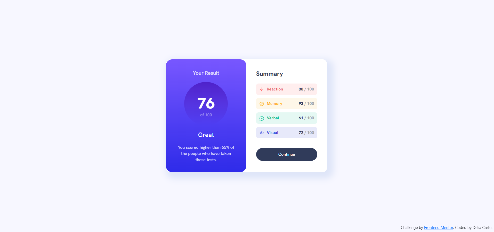

# Frontend Mentor - Results summary component solution

This is a solution to the [Results summary component challenge on Frontend Mentor](https://www.frontendmentor.io/challenges/results-summary-component-CE_K6s0maV). Frontend Mentor challenges help you improve your coding skills by building realistic projects.

## Table of contents

- [Overview](#overview)
  - [The challenge](#the-challenge)
  - [Screenshot](#screenshot)
  - [Links](#links)
- [My process](#my-process)
  - [Built with](#built-with)
  - [What I learned](#what-i-learned)
  - [Continued development](#continued-development)
  - [Useful resources](#useful-resources)

## Overview

### The challenge

Users should be able to:

- View the optimal layout depending on their device's screen size
- See hover states for interactive elements

### Screenshot



### Links

- Solution URL: https://github.com/delia-cretu/results-summary-component-main
- Live Site URL: https://delia-cretu.github.io/results-summary-component-main/

## My process

### Built with

- Semantic HTML5 markup
- CSS custom properties
- Flexbox

### What I learned

I learned how to do a colour gradient:

```css
.results-score {
  background-image: linear-gradient(
    hsla(256, 72%, 46%, 1),
    hsla(241, 72%, 46%, 0)
  );
}
```

I figured out how to make a div section have circular shape:

```css
.results-score {
  border-radius: 100%;
```

### Continued development

I continue to improve my knowledge of CSS Flexbox and how to make a design mobile responsie.

### Useful resources

- https://www.w3schools.com/css/css3_gradients.asp - Useful website about creating a gradient in CSS
